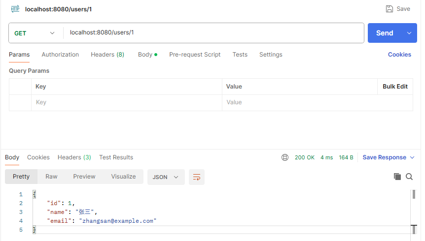
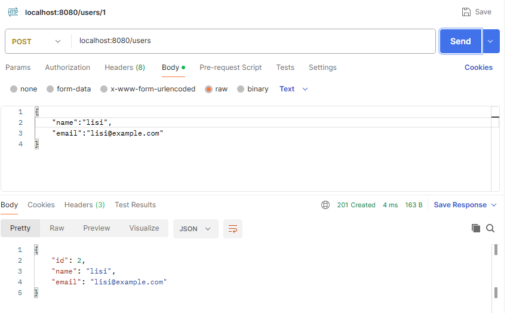
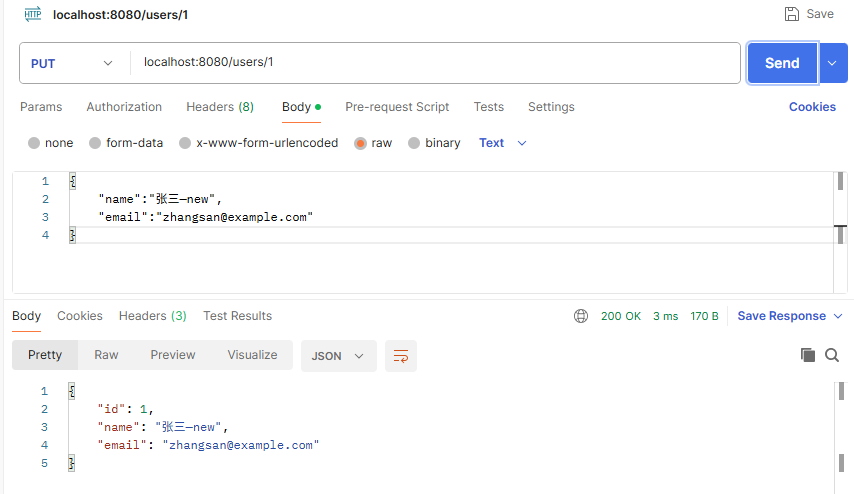
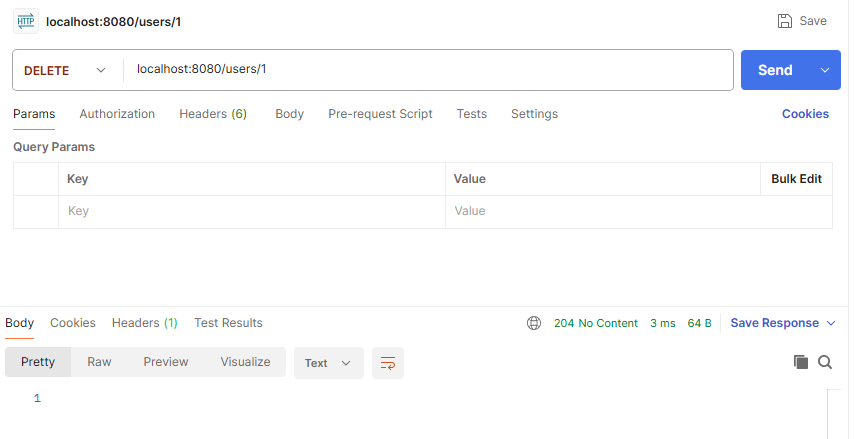
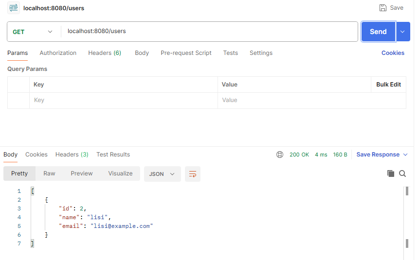

## 项目说明
这是一个基于Golang的用户信息管理服务，支持HTTP和gRPC协议


## 项目结构
```
jyb-resource-mgr/
├── cmd/
│   └── server/
│       └── main.go   # 程序入口
├── internal/
│   ├── handler/
│   │   ├── http.go   # HTTP处理器
│   │   └── grpc.go   # gRPC处理器
│   ├── service/
│   │   └── user.go   # 业务逻辑层（HTTP/gRPC共享）
│   └── model/
│       └── user.go   # 数据模型
├── api/
│   ├── user.proto       # protobuf 定义
│   └── user
│       └── v1
│          ├── user.pb.go       # 生成的message代码
│          └── user_grpc.pb.go  # 生成的gRPC代码
├── doc/                 
│   └── README.md        # 项目说明
├── go.mod
├── go.sum
└── .gitignore
```


## 快速启动

```bash
protoc --go_out=. --go-grpc_out=. api/user.proto # 在api目录下生成user.pb.go和user_grpc.pb.go文件
```

```bash
go run cmd/server/main.go # 启动服务
```


## 接口文档

### HTTP API

#### 获取用户
```
GET /users/{id}  
```



#### 创建用户
```
POST /users
```



#### 更新用户
```
PUT /users/{id}  
```



#### 删除用户
```
DELETE /users/{id}
```



#### 用户列表
```
GET /users
```



### gRPC API

| 方法            | 请求 | 响应 | 说明 |
|---------------|---|---|---|
| `GetUser`     | `GetUserRequest{id}` | `GetUserResponse{user}` | 获取单个用户 |
| `CreateUser`  | `CreateUserRequest{name, email}` | `CreateUserResponse{user}` | 创建用户 |
| `UpdateUser`  | `UpdateUserRequest{id, name, email}` | `UpdateUserResponse{user}` | 更新用户 |
| `DeleteUser`  | `DeleteUserRequest{id}` | `DeleteUserResponse{}` | 删除用户 |
| `ListUsers`   | `ListUsersRequest{}` | `ListUsersResponse{users}` | 用户列表 |

## 列出所有服务
```bash
A@blue-pony MINGW64 /d/code/go/src/jyb-resource-mgr (master)
$ grpcurl -plaintext localhost:9090 list
grpc.reflection.v1.ServerReflection
grpc.reflection.v1alpha.ServerReflection
user.v1.UserService
```


## 列出所有方法
```bash
A@blue-pony MINGW64 /d/code/go/src/jyb-resource-mgr (master)
$ grpcurl -plaintext localhost:9090 list user.v1.UserService
user.v1.UserService.CreateUser
user.v1.UserService.DeleteUser
user.v1.UserService.GetUser
user.v1.UserService.ListUsers
user.v1.UserService.UpdateUser
```


## 创建用户
```bash
A@blue-pony MINGW64 /d/code/go/src/jyb-resource-mgr (master)
$ grpcurl -plaintext -d '{"name":"李四","email":"lisi@example.com"}' \
localhost:9090 user.v1.UserService/CreateUser
{
    "user": {
    "id": 2,
    "name": "李四",
    "email": "lisi@example.com"
    }
}
```

## 获取用户
```bash
A@blue-pony MINGW64 /d/code/go/src/jyb-resource-mgr (master)
$ grpcurl -plaintext -d '{"id":1}' \
localhost:9090 user.v1.UserService/GetUser
{
  "user": {
  "id": 1,
  "name": "张三",
  "email": "zhangsan@example.com"
  }
}
```


## 获取不存在的用户
```bash
A@blue-pony MINGW64 /d/code/go/src/jyb-resource-mgr (master)
$ grpcurl -plaintext -d '{"id":999}' \
localhost:9090 user.v1.UserService/GetUser
ERROR:
Code: NotFound
Message: user 999: user 999 not found
```

## 创建用户
```bash
A@blue-pony MINGW64 /d/code/go/src/jyb-resource-mgr (master)
$ grpcurl -plaintext -d '{"name":"王五","email":"wangwu@example.com"}' \
localhost:9090 user.v1.UserService/CreateUser
{
    "user": {
      "id": 3,
      "name": "王五",
      "email": "wangwu@example.com"
    }
}
```

## 列出所有用户
```bash
A@blue-pony MINGW64 /d/code/go/src/jyb-resource-mgr (master)
$ grpcurl -plaintext localhost:9090 user.v1.UserService/ListUsers
{
    "users": [
        {
           "id": 2,
           "name": "李四",
           "email": "lisi@example.com"
        },
        {
           "id": 3,
           "name": "王五",
           "email": "wangwu@example.com"
        },
        {
           "id": 1,
           "name": "张三",
           "email": "zhangsan@example.com"
        }
    ]
}
```

## 删除用户
```bash
A@blue-pony MINGW64 /d/code/go/src/jyb-resource-mgr (master)
$ grpcurl -plaintext -d '{"id":1}' localhost:9090 user.v1.UserService/DeleteUser
{}
```

## 获取所有用户
```bash
A@blue-pony MINGW64 /d/code/go/src/jyb-resource-mgr (master)
$ grpcurl -plaintext localhost:9090 user.v1.UserService/ListUsers
{
    "users": [
        {
           "id": 2,
           "name": "李四",
           "email": "lisi@example.com"
        },
        {
           "id": 3,
           "name": "王五",
           "email": "wangwu@example.com"
        }
    ]
}
```

